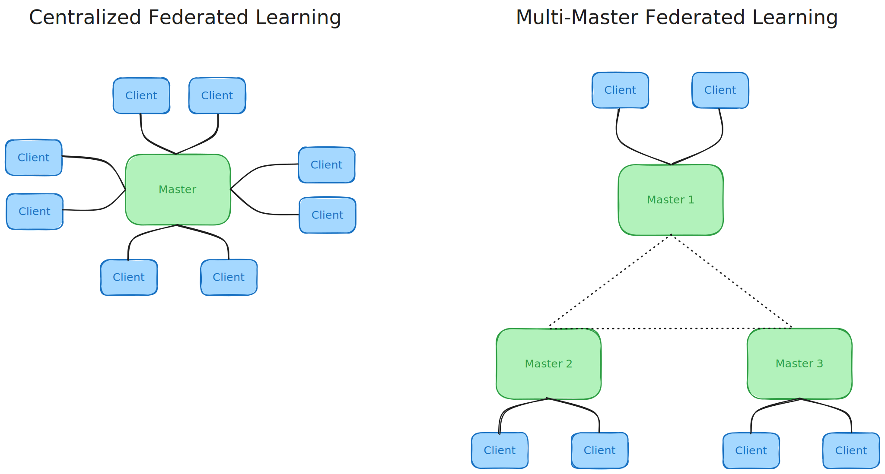
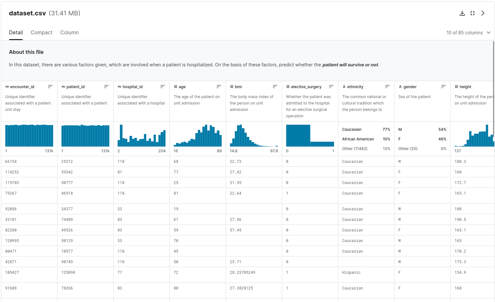

# Federated Learning Framework Analysis

This study explores two distinct implementations of Federated Learning, specifically Centralized Federated Learning and Multi-Master Federated Learning.



## Dataset



The dataset was taken from Kaggle ([link here](https://www.kaggle.com/datasets/mitishaagarwal/patient)) and it's about hospital data for predicting the outcomes of individuals affected by diabetes.

## Directory Structure

```bash
./root
|_ img/
|_ code/
|_ presentation.pdf
|_ report.pdf
```

In the `code/` directory you'll find all the needed code to run the simulation for both the Centralized and Multi-Master Federated Learning.

In the main directory you can find `report.pdf` in which we describe and discuss about the problem, the solution and the implementation of this one. There is also the `presentation.pdf` which is a pack of slides based on the report.

## Team

- [Mario Edoardo Pandolfo](https://github.com/JRhin)
- [Nicola Grieco](https://github.com/nicolagrieco00)
- [Davide Vigneri](https://github.com/VigneriDavide)
